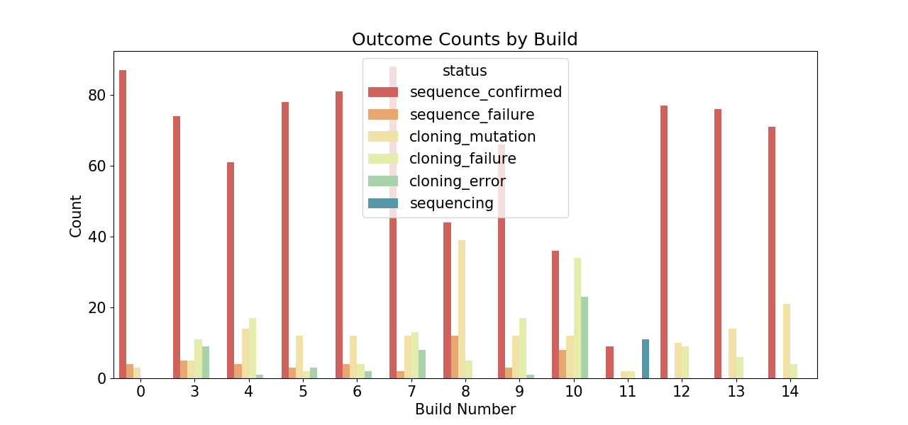
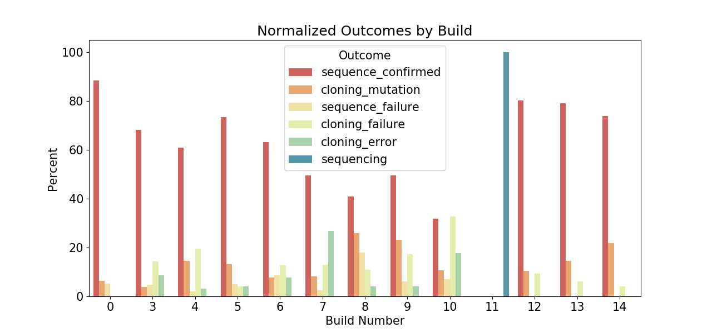
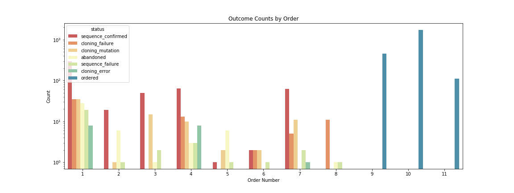
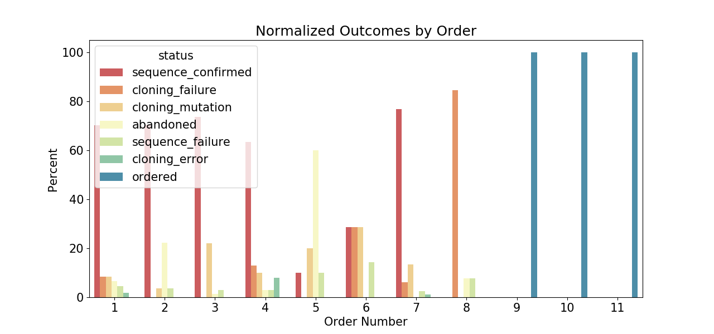
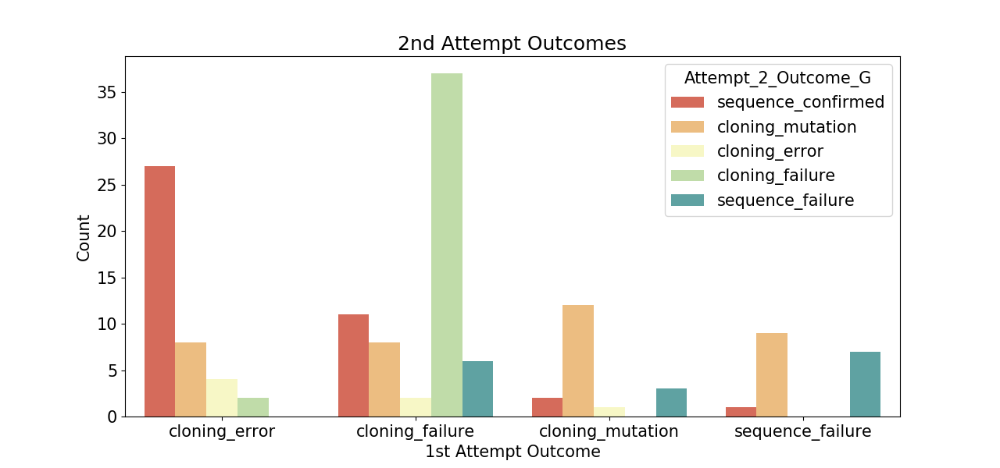
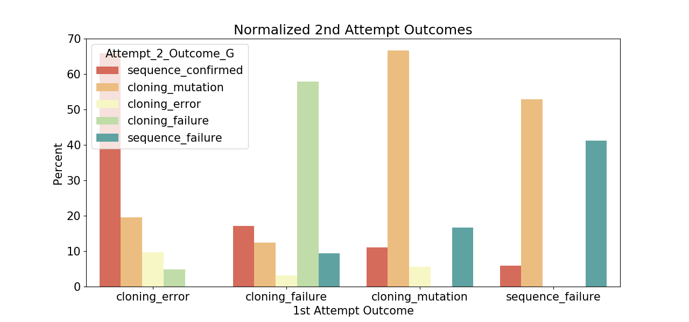
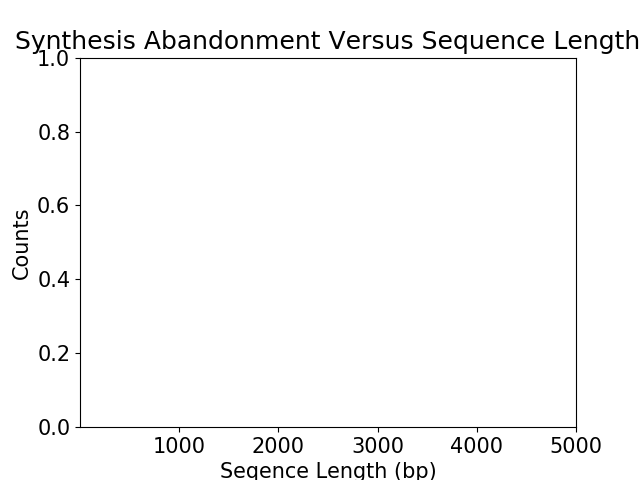
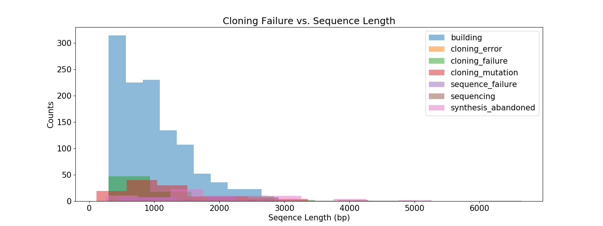

# Welcome to the Free Genes project

## Current status

<iframe width="800" height="500" src="sankey.html"></iframe>

### Above is a Sankey Diagram reflecting the current status of the Free Genes project workflow

## Cloning Results

### Individual Cloning Run Breakdown

### Individual Twist Order Breakdown

### Cloning Rework Breakdown

### Synthesis Failure Breakdown

### Cloning Failure versus Sequence Length

### Table of genes that have failed twice to clone

| Part ID | Gene Name | Sequence Length | # of Fragments | Part Type |
| ------------- | ------------- | :-------------: | :-------------: | ------------- |
| BBF10K_000157 | MMSYN1_0361 | 468 | 1 | cds |
| BBF10K_000032 | MMSYN1_0065 | 309 | 1 | cds |
| BBF10K_000013 | MMSYN1_0026 | 441 | 1 | cds |
| BBF10K_000014 | MMSYN1_0027 | 414 | 1 | cds |
| BBF10K_000282 | MMSYN1_0638 | 456 | 1 | cds |
| BBF10K_000242 | MMSYN1_0515 | 483 | 1 | cds |
| BBF10K_000068 | MMSYN1_0149 | 468 | 1 | cds |
| BBF10K_000116 | MMSYN1_0270 | 417 | 1 | cds |
| BBF10K_000042 | MMSYN1_0107 | 399 | 1 | cds |
| BBF10K_000295 | MMSYN1_0653 | 438 | 1 | cds |
| BBF10K_000183 | MMSYN1_0402 | 495 | 1 | cds |
| BBF10K_000063 | MMSYN1_0144 | 501 | 1 | cds |
| BBF10K_000340 | MMSYN1_0777 | 486 | 1 | cds |
| BBF10K_000083 | MMSYN1_0200 | 546 | 1 | cds |
| BBF10K_000100 | MMSYN1_0234 | 465 | 1 | cds |
| BBF10K_000130 | MMSYN1_0298 | 300 | 1 | cds |
| BBF10K_000174 | MMSYN1_0389 | 2145 | 2 | cds |
| BBF10K_000178 | MMSYN1_0394 | 2361 | 2 | cds |
| BBF10K_000219 | MMSYN1_0442 | 438 | 1 | cds |
| BBF10K_000223 | MMSYN1_0447 | 504 | 1 | cds |
| BBF10K_000236 | MMSYN1_0503 | 402 | 1 | cds |
| BBF10K_000249 | MMSYN1_0525 | 402 | 1 | cds |
| BBF10K_000089 | MMSYN1_0215 | 432 | 1 | cds |
| BBF10K_000288 | MMSYN1_0644 | 360 | 1 | cds |
| BBF10K_000320 | MMSYN1_0695 | 2169 | 2 | cds |
| BBF10K_000348 | MMSYN1_0794 | 546 | 1 | cds |
| BBF10K_000358 | MMSYN1_0807 | 498 | 1 | cds |
| BBF10K_000369 | MMSYN1_0823 | 1116 | 1 | cds |
| BBF10K_000377 | MMSYN1_0834 | 1317 | 1 | cds |
| BBF10K_000382 | MMSYN1_0839 | 324 | 1 | cds |
| BBF10K_000401 | MMSYN1_0909 | 330 | 1 | cds |
| BBF10K_000655 | Chlorobium vibrioforme C-20 methyltransferase | 1017 | 1 | cds |
| BBF10K_000656 | Pyrocystis lunula luciferase catalytic domain | 894 | 1 | cds |
| BBF10K_000657 | Raphanus sativus pheophorbidase | 792 | 1 | cds |
| BBF10K_000661 | pctV_Sni^opt | 1329 | 1 | cds |
| BBF10K_000303 | MMSYN1_0663 | 417 | 1 | cds |
| BBF10K_000235 | MMSYN1_0501 | 303 | 1 | cds |

##### Last updated: 2018-05-06
